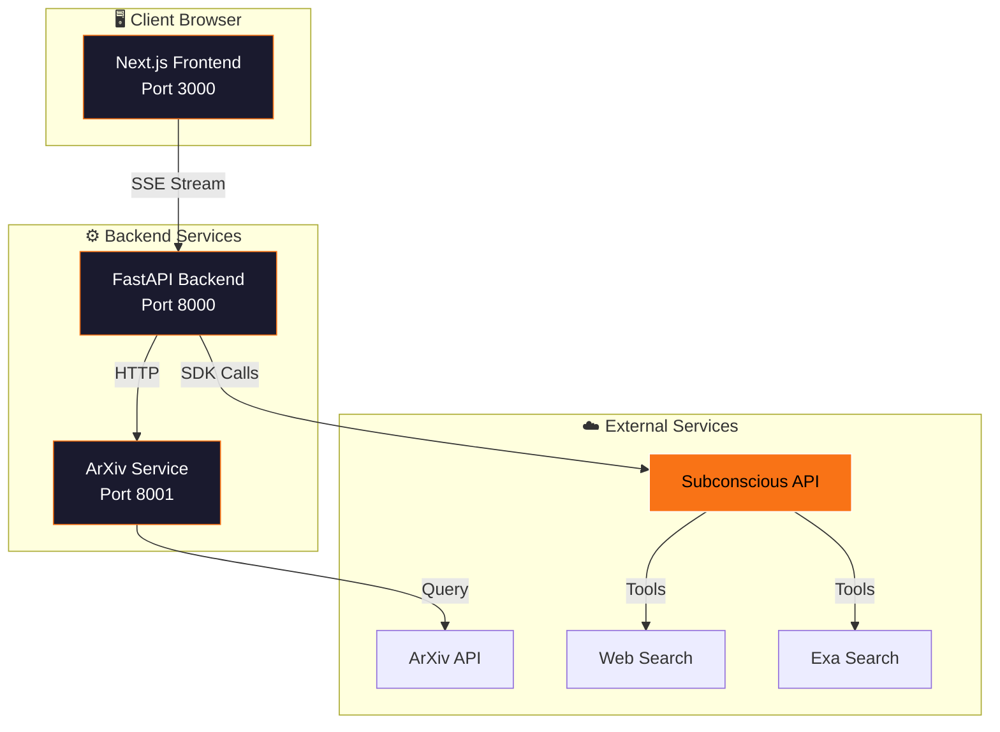
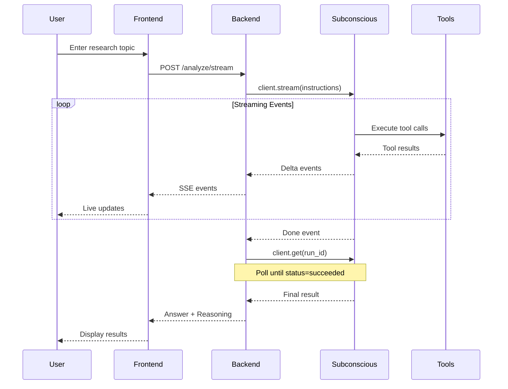
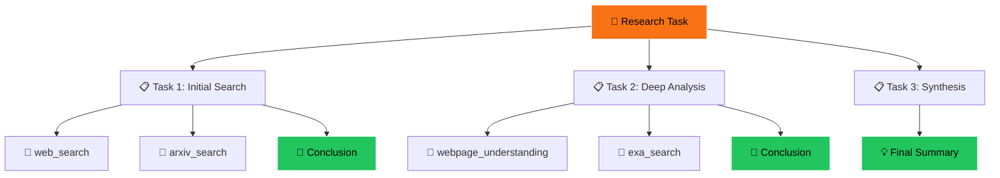

# 🔬 Research Paper Analyzer

> AI-powered research analysis platform built with [Subconscious AI](https://subconscious.dev) — Transform any research topic into comprehensive insights with reasoning traces.

[](https://nextjs.org/)
[](https://fastapi.tiangolo.com/)
[](https://www.typescriptlang.org/)
[](https://www.python.org/)
[](https://opensource.org/licenses/MIT)

---

## 📖 Table of Contents

- [Overview](#-overview)
- [Features](#-features)
- [Architecture](#-architecture)
- [Quick Start](#-quick-start)
- [Configuration](#-configuration)
- [API Reference](#-api-reference)
- [Project Structure](#-project-structure)
- [Testing](#-testing)
- [Deployment](#-deployment)
- [Troubleshooting](#-troubleshooting)
- [Contributing](#-contributing)
- [License](#-license)

---

## 🎯 Overview

Research Paper Analyzer is a full-stack application that leverages **Subconscious AI agents** to conduct comprehensive research on any topic. The AI agent uses multiple tools (web search, semantic search, ArXiv) to gather information, then synthesizes findings into structured analysis with full reasoning transparency.

### What makes it special?

- **Reasoning Transparency**: See exactly how the AI thinks with visual reasoning trees
- **Multi-Source Research**: Combines web search, Exa semantic search, and ArXiv academic papers
- **Real-Time Streaming**: Watch the research unfold in real-time with Server-Sent Events
- **Export Ready**: Download analysis as PDF or Markdown for sharing and archiving
- **Engine Selection**: Choose between different AI engines based on speed vs capability needs

---

## ✨ Features

| Feature | Description |
|---------|-------------|
| 🤖 **AI-Powered Analysis** | Subconscious TIM engines with multi-tool orchestration |
| 🔍 **Multi-Source Search** | Web search, Exa semantic search, ArXiv papers |
| 🌊 **Real-Time Streaming** | SSE streaming with instant event delivery |
| 🌳 **Reasoning Trees** | Interactive visualization of agent thought process |
| 📊 **Structured Output** | Papers, themes, gaps, and future directions |
| 📥 **Export Options** | PDF and Markdown export with professional formatting |
| ⚙️ **Engine Selection** | TIM Small (fast), TIM GPT, TIM Large (capable) |
| 🔧 **Tool Toggles** | Enable/disable individual research tools |
| 🌙 **Dark Theme** | Modern UI with Subconscious orange accents |
| 📱 **Responsive** | Works on desktop and mobile devices |

---

## 🏗 Architecture

### System Overview



### Data Flow



### Reasoning Tree Structure



---

## 🚀 Quick Start

### Prerequisites

| Requirement | Version | Purpose |
|-------------|---------|---------|
| Node.js | 18+ | Frontend runtime |
| Python | 3.11+ | Backend runtime |
| Subconscious API Key | - | [Get one here](https://subconscious.dev) |

### Option 1: Docker Compose (Recommended)

```bash
# Clone and navigate
git clone <repository-url>
cd research-paper-analyzer-v2

# Configure environment
cp .env.example .env
# Edit .env and add SUBCONSCIOUS_API_KEY

# Launch all services
docker-compose up --build

# Open browser
open http://localhost:3000
```

### Option 2: Manual Setup

**Terminal 1 - ArXiv Service:**
```bash
cd arxiv-service
python -m venv .venv && source .venv/bin/activate
pip install -r requirements.txt
uvicorn main:app --host 0.0.0.0 --port 8001
```

**Terminal 2 - Backend:**
```bash
cd backend
python -m venv .venv && source .venv/bin/activate
pip install -r requirements.txt

export SUBCONSCIOUS_API_KEY="your-api-key"
export ARXIV_SERVICE_URL="http://localhost:8001"

uvicorn app.main:app --host 0.0.0.0 --port 8000 --reload
```

**Terminal 3 - Frontend:**
```bash
cd frontend
npm install
npm run dev
```

**Open http://localhost:3000** 🎉

---

## ⚙️ Configuration

### Environment Variables

#### Backend (`backend/.env`)

| Variable | Required | Default | Description |
|----------|----------|---------|-------------|
| `SUBCONSCIOUS_API_KEY` | ✅ | - | Your Subconscious API key |
| `SUBCONSCIOUS_ENGINE` | ❌ | `tim-large` | Default AI engine |
| `ARXIV_SERVICE_URL` | ❌ | `http://localhost:8001` | ArXiv service endpoint |
| `MAX_RETRIES` | ❌ | `5` | Max retry attempts |
| `RETRY_DELAY` | ❌ | `2` | Initial retry delay (seconds) |
| `LOG_LEVEL` | ❌ | `INFO` | Logging verbosity |

#### Frontend (`frontend/.env.local`)

| Variable | Required | Default | Description |
|----------|----------|---------|-------------|
| `NEXT_PUBLIC_API_URL` | ❌ | `http://localhost:8000` | Backend API URL |

### Available Engines

| Engine ID | Name | Description | Use Case |
|-----------|------|-------------|----------|
| `tim-small-preview` | TIM Small | Fast, lightweight | Quick queries |
| `tim-gpt` | TIM GPT | GPT-powered | Balanced performance |
| `tim-large` | TIM Large | Most capable | Deep research |

### Available Tools

| Tool ID | Name | Description |
|---------|------|-------------|
| `web_search` | Web Search | General web search |
| `webpage_understanding` | Webpage Understanding | Read and analyze web pages |
| `exa_search` | Exa Search | Semantic search engine |
| `arxiv_search` | ArXiv Search | Academic paper search (custom) |

---

## 📡 API Reference

### Backend Endpoints

#### Health Check
```http
GET /health
```
Returns service health status.

#### List Engines
```http
GET /api/research/engines
```
Returns available AI engines.

#### List Tools
```http
GET /api/research/tools
```
Returns available platform tools.

#### Stream Analysis (Primary)
```http
POST /api/research/analyze/stream
Content-Type: application/json

{
  "topic": "transformer architectures in NLP",
  "engine": "tim-gpt",
  "tools": ["web_search", "exa_search"],
  "include_arxiv": true
}
```

**Response:** Server-Sent Events stream

| Event Type | Description |
|------------|-------------|
| `status` | Phase updates (init, connecting, researching, finalizing) |
| `activity` | Delta processing with content |
| `done` | Final answer and reasoning tree |
| `error` | Error message |

#### Get Run Status
```http
GET /api/research/status/{run_id}
```
Returns status of a specific run.

### ArXiv Service Endpoints

#### Search Papers
```http
POST /search
Content-Type: application/json

{
  "query": "attention mechanisms",
  "max_results": 10
}
```

---

## 📁 Project Structure

```
research-paper-analyzer-v2/
│
├── 📂 frontend/                    # Next.js 15 Application
│   ├── 📂 app/
│   │   ├── globals.css            # Global styles & dark theme
│   │   ├── layout.tsx             # Root layout with metadata
│   │   └── page.tsx               # Main application page
│   ├── 📂 components/
│   │   ├── Header.tsx             # Application header
│   │   ├── SearchForm.tsx         # Topic input with options
│   │   ├── ReasoningTree.tsx      # Interactive tree view
│   │   ├── ActivityLog.tsx        # Real-time activity feed
│   │   ├── ExportButtons.tsx      # PDF/Markdown export
│   │   └── RawJsonView.tsx        # Debug JSON viewer
│   ├── 📂 hooks/
│   │   └── useStreamingSSE.ts     # SSE streaming hook
│   ├── 📂 lib/
│   │   ├── api.ts                 # API client functions
│   │   ├── store.ts               # Zustand state management
│   │   ├── types.ts               # TypeScript definitions
│   │   └── export.ts              # PDF/Markdown generation
│   ├── package.json
│   ├── tailwind.config.js
│   └── Dockerfile
│
├── 📂 backend/                     # FastAPI Backend
│   ├── 📂 app/
│   │   ├── main.py                # Application entry point
│   │   ├── config.py              # Pydantic settings
│   │   ├── 📂 routes/
│   │   │   ├── health.py          # Health check endpoints
│   │   │   └── research.py        # Research API endpoints
│   │   ├── 📂 services/
│   │   │   └── subconscious.py    # Subconscious SDK wrapper
│   │   └── 📂 models/
│   │       ├── schemas.py         # Request/response schemas
│   │       └── types.py           # Type definitions
│   ├── requirements.txt
│   └── Dockerfile
│
├── 📂 arxiv-service/               # ArXiv Microservice
│   ├── main.py                    # FastAPI application
│   ├── requirements.txt
│   └── Dockerfile
│
├── 📂 docs/                        # Documentation
│   ├── DEPLOYMENT.md              # Deployment guide
│   └── TESTING.md                 # Testing guide
│
├── docker-compose.yml              # Container orchestration
├── .env.example                    # Environment template
├── LICENSE                         # MIT License
└── README.md                       # This file
```

---

## 🧪 Testing

See [docs/TESTING.md](docs/TESTING.md) for comprehensive testing guide.

### Quick Test Commands

```bash
# Backend unit tests
cd backend
pytest tests/ -v

# Frontend type checking
cd frontend
npm run lint
npx tsc --noEmit

# Integration test (requires running services)
curl -X POST http://localhost:8000/api/research/analyze/stream \
  -H "Content-Type: application/json" \
  -d '{"topic": "machine learning basics", "include_arxiv": false}'
```

---

## 🚢 Deployment

See [docs/DEPLOYMENT.md](docs/DEPLOYMENT.md) for comprehensive deployment guide.

### Quick Deploy to Vercel

**Frontend:**
```bash
cd frontend
vercel --prod
```

**Backend:** Deploy to Railway, Render, or any Docker-compatible platform.

---

## 🐛 Troubleshooting

### Common Issues

| Issue | Solution |
|-------|----------|
| **"Engine warming up"** | Subconscious engines need warmup time. Retry logic handles this automatically. |
| **Empty analysis results** | Backend now polls until run status is `succeeded`. Check logs for polling progress. |
| **Streaming delays** | Updated to use `sse-starlette` + `@microsoft/fetch-event-source` for instant delivery. |
| **ArXiv not working** | Ensure ArXiv service is running and `ARXIV_SERVICE_URL` is correct. |
| **CORS errors** | Add your frontend URL to `CORS_ORIGINS` in backend config. |

### Debug Mode

Enable verbose logging:
```bash
# Backend
export LOG_LEVEL=DEBUG
uvicorn app.main:app --reload

# Frontend - check browser console for [SSE] logs
```

---

## 🤝 Contributing

1. Fork the repository
2. Create a feature branch (`git checkout -b feature/amazing-feature`)
3. Commit changes (`git commit -m 'Add amazing feature'`)
4. Push to branch (`git push origin feature/amazing-feature`)
5. Open a Pull Request

---

## 📄 License

This project is licensed under the MIT License - see the [LICENSE](LICENSE) file for details.

---

## 🙏 Acknowledgments

- [Subconscious](https://subconscious.dev) - AI Agent Platform
- [ArXiv](https://arxiv.org) - Open Access Academic Papers
- [Vercel](https://vercel.com) - Frontend Deployment
- [FastAPI](https://fastapi.tiangolo.com) - Backend Framework

---

<div align="center">

**Built with ❤️ using [Subconscious AI](https://subconscious.dev)**

[Report Bug](../../issues) · [Request Feature](../../issues) · [Documentation](https://docs.subconscious.dev)

</div>
