# 🚢 Deployment Guide

This guide covers deploying the Research Paper Analyzer to production environments.

---

## 📋 Table of Contents

- [Deployment Architecture](#-deployment-architecture)
- [Prerequisites](#-prerequisites)
- [Frontend Deployment (Vercel)](#-frontend-deployment-vercel)
- [Backend Deployment Options](#-backend-deployment-options)
- [ArXiv Service Deployment](#-arxiv-service-deployment)
- [Environment Configuration](#-environment-configuration)
- [Post-Deployment Verification](#-post-deployment-verification)
- [Monitoring & Logging](#-monitoring--logging)
- [Troubleshooting](#-troubleshooting)

---

## 🏗 Deployment Architecture

```mermaid
flowchart TB
    subgraph Vercel["☁️ Vercel (Frontend)"]
        FE[Next.js App<br/>Edge Network]
    end

    subgraph Railway["🚂 Railway / Render (Backend)"]
        BE[FastAPI Backend]
        AX[ArXiv Service]
    end

    subgraph External["🌐 External"]
        SUB[Subconscious API]
        ARXIV[ArXiv API]
    end

    Users((Users)) -->|HTTPS| FE
    FE -->|API Calls| BE
    BE -->|SDK| SUB
    BE -->|HTTP| AX
    AX -->|Query| ARXIV

    style FE fill:#000,stroke:#fff,color:#fff
    style BE fill:#0f172a,stroke:#f97316,color:#fff
    style AX fill:#0f172a,stroke:#f97316,color:#fff
    style SUB fill:#f97316,stroke:#fff,color:#000
```



### Recommended Stack

| Component | Platform | Why |
|-----------|----------|-----|
| Frontend | **Vercel** | Native Next.js support, edge network, free tier |
| Backend | **Railway** / **Render** | Easy Python deployment, Docker support |
| ArXiv Service | **Railway** / **Render** | Co-locate with backend |

---

## ✅ Prerequisites

Before deploying, ensure you have:

- [ ] Subconscious API key ([Get one](https://subconscious.dev))
- [ ] Vercel account ([Sign up](https://vercel.com))
- [ ] Railway or Render account
- [ ] Git repository with your code
- [ ] All services tested locally

---

## 🔺 Frontend Deployment (Vercel)

### Method 1: Vercel CLI (Recommended)

**Step 1: Install Vercel CLI**
```bash
npm install -g vercel
```

**Step 2: Login to Vercel**
```bash
vercel login
```

**Step 3: Deploy**
```bash
cd frontend

# Preview deployment
vercel

# Production deployment
vercel --prod
```

**Step 4: Configure Environment Variables**

In Vercel Dashboard → Your Project → Settings → Environment Variables:

| Variable | Value | Environment |
|----------|-------|-------------|
| `NEXT_PUBLIC_API_URL` | `https://your-backend-url.railway.app` | Production |

### Method 2: GitHub Integration

1. Push your code to GitHub
2. Go to [vercel.com/new](https://vercel.com/new)
3. Import your repository
4. Configure:
   - **Framework Preset:** Next.js
   - **Root Directory:** `frontend`
   - **Build Command:** `npm run build`
   - **Output Directory:** `.next`
5. Add environment variables
6. Click **Deploy**

### Vercel Configuration File

Create `frontend/vercel.json`:

```json
{
  "buildCommand": "npm run build",
  "outputDirectory": ".next",
  "framework": "nextjs",
  "regions": ["sfo1"],
  "env": {
    "NEXT_PUBLIC_API_URL": "@backend_url"
  },
  "headers": [
    {
      "source": "/(.*)",
      "headers": [
        {
          "key": "X-Content-Type-Options",
          "value": "nosniff"
        },
        {
          "key": "X-Frame-Options",
          "value": "DENY"
        },
        {
          "key": "X-XSS-Protection",
          "value": "1; mode=block"
        }
      ]
    }
  ]
}
```

---

## 🐍 Backend Deployment Options

### Option A: Railway (Recommended)

**Step 1: Create Railway Project**
```bash
# Install Railway CLI
npm install -g @railway/cli

# Login
railway login

# Initialize project
cd backend
railway init
```

**Step 2: Configure Service**

Create `backend/railway.json`:
```json
{
  "$schema": "https://railway.app/railway.schema.json",
  "build": {
    "builder": "DOCKERFILE",
    "dockerfilePath": "Dockerfile"
  },
  "deploy": {
    "startCommand": "uvicorn app.main:app --host 0.0.0.0 --port $PORT",
    "healthcheckPath": "/health",
    "healthcheckTimeout": 30,
    "restartPolicyType": "ON_FAILURE",
    "restartPolicyMaxRetries": 3
  }
}
```

**Step 3: Set Environment Variables**

In Railway Dashboard → Variables:

```
SUBCONSCIOUS_API_KEY=your-api-key
SUBCONSCIOUS_ENGINE=tim-large
ARXIV_SERVICE_URL=https://your-arxiv-service.railway.app
LOG_LEVEL=INFO
MAX_RETRIES=5
RETRY_DELAY=2
```

**Step 4: Deploy**
```bash
railway up
```

### Option B: Render

**Step 1: Create `render.yaml`**

```yaml
services:
  - type: web
    name: research-analyzer-backend
    env: python
    region: oregon
    plan: starter
    buildCommand: pip install -r requirements.txt
    startCommand: uvicorn app.main:app --host 0.0.0.0 --port $PORT
    healthCheckPath: /health
    envVars:
      - key: SUBCONSCIOUS_API_KEY
        sync: false
      - key: SUBCONSCIOUS_ENGINE
        value: tim-large
      - key: ARXIV_SERVICE_URL
        value: https://your-arxiv-service.onrender.com
      - key: LOG_LEVEL
        value: INFO
```

**Step 2: Deploy via Dashboard**
1. Go to [dashboard.render.com](https://dashboard.render.com)
2. New → Web Service
3. Connect your repository
4. Set Root Directory: `backend`
5. Add environment variables
6. Click Create Web Service

### Option C: Docker (Any Platform)

```bash
# Build image
cd backend
docker build -t research-analyzer-backend .

# Run container
docker run -d \
  -p 8000:8000 \
  -e SUBCONSCIOUS_API_KEY=your-key \
  -e ARXIV_SERVICE_URL=http://arxiv-service:8001 \
  research-analyzer-backend
```

---

## 📚 ArXiv Service Deployment

Deploy alongside backend using the same platform.

### Railway

```bash
cd arxiv-service
railway init
railway up
```

### Render

Add to `render.yaml`:
```yaml
  - type: web
    name: research-analyzer-arxiv
    env: python
    region: oregon
    plan: starter
    buildCommand: pip install -r requirements.txt
    startCommand: uvicorn main:app --host 0.0.0.0 --port $PORT
    healthCheckPath: /health
```

---

## ⚙️ Environment Configuration

### Production Environment Variables

#### Backend Service

| Variable | Production Value | Notes |
|----------|------------------|-------|
| `SUBCONSCIOUS_API_KEY` | `sk-...` | Keep secret! |
| `SUBCONSCIOUS_ENGINE` | `tim-large` | Or `tim-gpt` |
| `ARXIV_SERVICE_URL` | `https://arxiv.your-domain.com` | Internal URL |
| `LOG_LEVEL` | `WARNING` | Reduce noise |
| `MAX_RETRIES` | `5` | Handle cold starts |
| `RETRY_DELAY` | `3` | Slightly longer in prod |
| `CORS_ORIGINS` | `https://your-app.vercel.app` | Frontend URL |

#### Frontend Service

| Variable | Production Value | Notes |
|----------|------------------|-------|
| `NEXT_PUBLIC_API_URL` | `https://api.your-domain.com` | Backend URL |

### Secrets Management

**Vercel:** Use Vercel Secrets
```bash
vercel secrets add backend_url https://your-backend.railway.app
```

**Railway:** Use Railway Variables (encrypted at rest)

**Render:** Use Environment Groups for shared secrets

---

## ✅ Post-Deployment Verification

### Health Check Script

```bash
#!/bin/bash

FRONTEND_URL="https://your-app.vercel.app"
BACKEND_URL="https://your-backend.railway.app"
ARXIV_URL="https://your-arxiv.railway.app"

echo "🔍 Checking services..."

# Frontend
echo -n "Frontend: "
curl -s -o /dev/null -w "%{http_code}" $FRONTEND_URL && echo " ✅" || echo " ❌"

# Backend
echo -n "Backend Health: "
curl -s -o /dev/null -w "%{http_code}" $BACKEND_URL/health && echo " ✅" || echo " ❌"

# ArXiv Service
echo -n "ArXiv Service: "
curl -s -o /dev/null -w "%{http_code}" $ARXIV_URL/health && echo " ✅" || echo " ❌"

# Backend Engines
echo -n "Engines API: "
curl -s $BACKEND_URL/api/research/engines | jq -r '.engines | length' && echo " engines found"

# Test Analysis
echo "🧪 Testing analysis endpoint..."
curl -X POST $BACKEND_URL/api/research/analyze/stream \
  -H "Content-Type: application/json" \
  -d '{"topic": "test query", "include_arxiv": false}' \
  --max-time 30 \
  -s | head -5

echo "✨ Deployment verification complete!"
```

### Manual Verification Checklist

- [ ] Frontend loads without errors
- [ ] Backend `/health` returns 200
- [ ] ArXiv `/health` returns 200
- [ ] Analysis stream starts successfully
- [ ] Results populate after completion
- [ ] Export buttons work (PDF/Markdown)
- [ ] No CORS errors in browser console

---

## 📊 Monitoring & Logging

### Vercel Analytics

Enable in `frontend/next.config.js`:
```javascript
/** @type {import('next').NextConfig} */
const nextConfig = {
  output: 'standalone',
  // Enable analytics
  experimental: {
    webVitals: true,
  },
}

module.exports = nextConfig
```

### Backend Logging

The backend uses structured logging. In production:

```python
# app/config.py
import logging

logging.basicConfig(
    level=logging.WARNING,  # Reduce noise
    format='%(asctime)s | %(levelname)-8s | %(name)s | %(message)s',
)
```

### Monitoring Services

| Platform | Free Tier | Features |
|----------|-----------|----------|
| **Vercel Analytics** | Yes | Web vitals, page views |
| **Railway Metrics** | Yes | CPU, memory, requests |
| **Render Metrics** | Yes | Basic metrics |
| **Better Stack** | Yes | Logs, uptime monitoring |
| **Sentry** | Yes | Error tracking |

---

## 🐛 Troubleshooting

### Common Deployment Issues

| Issue | Cause | Solution |
|-------|-------|----------|
| **Build fails on Vercel** | Missing env vars | Add `NEXT_PUBLIC_API_URL` |
| **CORS errors** | Backend CORS config | Add Vercel URL to `CORS_ORIGINS` |
| **502 Bad Gateway** | Backend not ready | Increase health check timeout |
| **SSE not working** | Proxy buffering | Add `X-Accel-Buffering: no` header |
| **Cold start timeout** | Engine warming | Increase `MAX_RETRIES` |

### Debug Mode

**Frontend (Vercel):**
```bash
vercel logs your-project --follow
```

**Backend (Railway):**
```bash
railway logs --follow
```

### Force Redeploy

```bash
# Vercel
vercel --prod --force

# Railway
railway up --force
```

---

## 🔒 Security Checklist

- [ ] API keys stored as secrets (never in code)
- [ ] HTTPS enabled on all services
- [ ] CORS restricted to known origins
- [ ] Rate limiting enabled (if available)
- [ ] Security headers configured
- [ ] No sensitive data in logs

---

## 📚 Additional Resources

- [Vercel Documentation](https://vercel.com/docs)
- [Railway Documentation](https://docs.railway.app)
- [Render Documentation](https://render.com/docs)
- [Subconscious Documentation](https://docs.subconscious.dev)
- [Next.js Deployment](https://nextjs.org/docs/deployment)
- [FastAPI Deployment](https://fastapi.tiangolo.com/deployment/)

---

<div align="center">

**Need help?** Open an issue or check the [troubleshooting guide](#-troubleshooting).

</div>
