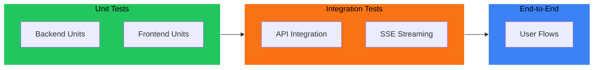

# 🧪 Testing Guide

Comprehensive testing guide for the Research Paper Analyzer application.

---

## 📋 Table of Contents

- [Testing Overview](#-testing-overview)
- [Local Testing Setup](#-local-testing-setup)
- [Backend Testing](#-backend-testing)
- [Frontend Testing](#-frontend-testing)
- [Integration Testing](#-integration-testing)
- [End-to-End Testing](#-end-to-end-testing)
- [Performance Testing](#-performance-testing)
- [Testing Checklist](#-testing-checklist)

---

## 🎯 Testing Overview



### Testing Pyramid

| Level | Scope | Tools | Speed |
|-------|-------|-------|-------|
| **Unit** | Individual functions | pytest, Jest | ⚡ Fast |
| **Integration** | API endpoints, services | pytest, curl | 🔄 Medium |
| **E2E** | Full user workflows | Playwright, Cypress | 🐢 Slow |

---

## 🛠 Local Testing Setup

### Prerequisites

```bash
# Backend
cd backend
python -m venv .venv
source .venv/bin/activate
pip install -r requirements.txt
pip install pytest pytest-asyncio httpx

# Frontend
cd frontend
npm install
```

### Start Services for Testing

```bash
# Terminal 1: ArXiv Service
cd arxiv-service && uvicorn main:app --port 8001

# Terminal 2: Backend
cd backend && uvicorn app.main:app --port 8000 --reload

# Terminal 3: Frontend
cd frontend && npm run dev
```

---

## 🐍 Backend Testing

### Unit Tests

Create `backend/tests/test_services.py`:

```python
"""Unit tests for backend services."""
import pytest
from unittest.mock import Mock, patch, MagicMock
from app.services.subconscious import SubconsciousService, get_available_engines, get_available_tools


class TestSubconsciousService:
    """Tests for SubconsciousService class."""
    
    @patch('app.services.subconscious.Subconscious')
    def test_service_initialization(self, mock_client):
        """Test service initializes with correct engine."""
        with patch('app.services.subconscious.get_settings') as mock_settings:
            mock_settings.return_value.SUBCONSCIOUS_API_KEY = "test-key"
            mock_settings.return_value.SUBCONSCIOUS_ENGINE = "tim-gpt"
            mock_settings.return_value.ARXIV_SERVICE_URL = "http://localhost:8001"
            mock_settings.return_value.MAX_RETRIES = 3
            mock_settings.return_value.RETRY_DELAY = 1
            
            service = SubconsciousService(engine="tim-small-preview")
            
            assert service.engine == "tim-small-preview"
            mock_client.assert_called_once_with(api_key="test-key")
    
    def test_get_available_engines(self):
        """Test available engines list."""
        engines = get_available_engines()
        
        assert len(engines) >= 3
        engine_ids = [e["id"] for e in engines]
        assert "tim-small-preview" in engine_ids
        assert "tim-gpt" in engine_ids
        assert "tim-large" in engine_ids
    
    def test_get_available_tools(self):
        """Test available tools list."""
        tools = get_available_tools()
        
        assert len(tools) >= 3
        tool_ids = [t["id"] for t in tools]
        assert "web_search" in tool_ids
        assert "exa_search" in tool_ids


class TestBuildInstructions:
    """Tests for instruction building."""
    
    @patch('app.services.subconscious.get_settings')
    @patch('app.services.subconscious.Subconscious')
    def test_instructions_contain_topic(self, mock_client, mock_settings):
        """Test that instructions include the research topic."""
        mock_settings.return_value.SUBCONSCIOUS_API_KEY = "test-key"
        mock_settings.return_value.SUBCONSCIOUS_ENGINE = "tim-gpt"
        mock_settings.return_value.ARXIV_SERVICE_URL = ""
        mock_settings.return_value.MAX_RETRIES = 3
        mock_settings.return_value.RETRY_DELAY = 1
        
        service = SubconsciousService()
        instructions = service._build_instructions("quantum computing")
        
        assert "quantum computing" in instructions
        assert "Research Topic" in instructions


class TestToolConfiguration:
    """Tests for tool configuration."""
    
    @patch('app.services.subconscious.get_settings')
    @patch('app.services.subconscious.Subconscious')
    def test_default_tools(self, mock_client, mock_settings):
        """Test default tool configuration."""
        mock_settings.return_value.SUBCONSCIOUS_API_KEY = "test-key"
        mock_settings.return_value.SUBCONSCIOUS_ENGINE = "tim-gpt"
        mock_settings.return_value.ARXIV_SERVICE_URL = ""
        mock_settings.return_value.MAX_RETRIES = 3
        mock_settings.return_value.RETRY_DELAY = 1
        
        service = SubconsciousService()
        tools = service._get_tools(include_arxiv=False)
        
        # Should have 3 platform tools by default
        assert len(tools) == 3
        tool_ids = [t["id"] for t in tools]
        assert "web_search" in tool_ids
    
    @patch('app.services.subconscious.get_settings')
    @patch('app.services.subconscious.Subconscious')
    def test_custom_tools(self, mock_client, mock_settings):
        """Test custom tool selection."""
        mock_settings.return_value.SUBCONSCIOUS_API_KEY = "test-key"
        mock_settings.return_value.SUBCONSCIOUS_ENGINE = "tim-gpt"
        mock_settings.return_value.ARXIV_SERVICE_URL = ""
        mock_settings.return_value.MAX_RETRIES = 3
        mock_settings.return_value.RETRY_DELAY = 1
        
        service = SubconsciousService()
        tools = service._get_tools(tool_ids=["web_search"], include_arxiv=False)
        
        assert len(tools) == 1
        assert tools[0]["id"] == "web_search"
    
    @patch('app.services.subconscious.get_settings')
    @patch('app.services.subconscious.Subconscious')
    def test_arxiv_tool_added(self, mock_client, mock_settings):
        """Test ArXiv tool is added when enabled."""
        mock_settings.return_value.SUBCONSCIOUS_API_KEY = "test-key"
        mock_settings.return_value.SUBCONSCIOUS_ENGINE = "tim-gpt"
        mock_settings.return_value.ARXIV_SERVICE_URL = "http://localhost:8001"
        mock_settings.return_value.MAX_RETRIES = 3
        mock_settings.return_value.RETRY_DELAY = 1
        
        service = SubconsciousService()
        tools = service._get_tools(tool_ids=["web_search"], include_arxiv=True)
        
        assert len(tools) == 2
        tool_names = [t.get("id") or t.get("name") for t in tools]
        assert "arxiv_search" in tool_names
```

### Running Backend Tests

```bash
cd backend

# Run all tests
pytest tests/ -v

# Run with coverage
pytest tests/ -v --cov=app --cov-report=html

# Run specific test file
pytest tests/test_services.py -v

# Run specific test
pytest tests/test_services.py::TestSubconsciousService::test_service_initialization -v
```

### API Endpoint Tests

Create `backend/tests/test_routes.py`:

```python
"""Tests for API routes."""
import pytest
from fastapi.testclient import TestClient
from app.main import app

client = TestClient(app)


class TestHealthEndpoint:
    """Tests for health check endpoint."""
    
    def test_health_check(self):
        """Test health endpoint returns OK."""
        response = client.get("/health")
        
        assert response.status_code == 200
        data = response.json()
        assert data["status"] == "healthy"


class TestEnginesEndpoint:
    """Tests for engines endpoint."""
    
    def test_list_engines(self):
        """Test listing available engines."""
        response = client.get("/api/research/engines")
        
        assert response.status_code == 200
        data = response.json()
        assert "engines" in data
        assert len(data["engines"]) > 0


class TestToolsEndpoint:
    """Tests for tools endpoint."""
    
    def test_list_tools(self):
        """Test listing available tools."""
        response = client.get("/api/research/tools")
        
        assert response.status_code == 200
        data = response.json()
        assert "tools" in data
        assert len(data["tools"]) > 0


class TestAnalyzeEndpoint:
    """Tests for analyze endpoint."""
    
    def test_analyze_validation_error(self):
        """Test validation error for short topic."""
        response = client.post(
            "/api/research/analyze/stream",
            json={"topic": "ab"}  # Too short
        )
        
        assert response.status_code == 422  # Validation error
    
    def test_analyze_missing_topic(self):
        """Test error when topic is missing."""
        response = client.post(
            "/api/research/analyze/stream",
            json={}
        )
        
        assert response.status_code == 422
```

---

## ⚛️ Frontend Testing

### Type Checking

```bash
cd frontend

# TypeScript type checking
npx tsc --noEmit

# ESLint
npm run lint
```

### Component Testing with Jest

Create `frontend/jest.config.js`:

```javascript
const nextJest = require('next/jest')

const createJestConfig = nextJest({
  dir: './',
})

const customJestConfig = {
  setupFilesAfterEnv: ['<rootDir>/jest.setup.js'],
  testEnvironment: 'jest-environment-jsdom',
  moduleNameMapper: {
    '^@/(.*)$': '<rootDir>/$1',
  },
}

module.exports = createJestConfig(customJestConfig)
```

Create `frontend/jest.setup.js`:

```javascript
import '@testing-library/jest-dom'
```

Example component test `frontend/__tests__/Header.test.tsx`:

```typescript
import { render, screen } from '@testing-library/react'
import Header from '@/components/Header'

describe('Header', () => {
  it('renders the application title', () => {
    render(<Header />)
    
    expect(screen.getByText(/Research Paper Analyzer/i)).toBeInTheDocument()
  })
})
```

### Running Frontend Tests

```bash
cd frontend

# Install test dependencies
npm install --save-dev jest @testing-library/react @testing-library/jest-dom jest-environment-jsdom

# Run tests
npm test

# Run with coverage
npm test -- --coverage
```

---

## 🔗 Integration Testing

### API Integration Tests

```bash
# Test health endpoints
curl http://localhost:8000/health
curl http://localhost:8001/health

# Test engines endpoint
curl http://localhost:8000/api/research/engines | jq

# Test tools endpoint
curl http://localhost:8000/api/research/tools | jq
```

### SSE Streaming Test

```bash
# Test streaming endpoint
curl -N -X POST http://localhost:8000/api/research/analyze/stream \
  -H "Content-Type: application/json" \
  -d '{"topic": "machine learning basics", "include_arxiv": false}' \
  --max-time 120
```

### ArXiv Service Test

```bash
# Test ArXiv search
curl -X POST http://localhost:8001/search \
  -H "Content-Type: application/json" \
  -d '{"query": "transformer attention", "max_results": 5}' | jq
```

### Integration Test Script

Create `scripts/integration-test.sh`:

```bash
#!/bin/bash

set -e

echo "🧪 Running Integration Tests"
echo "=============================="

BASE_URL="${BASE_URL:-http://localhost:8000}"
ARXIV_URL="${ARXIV_URL:-http://localhost:8001}"

# Colors
GREEN='\033[0;32m'
RED='\033[0;31m'
NC='\033[0m' # No Color

pass() { echo -e "${GREEN}✓ $1${NC}"; }
fail() { echo -e "${RED}✗ $1${NC}"; exit 1; }

# Test 1: Backend Health
echo -n "Testing backend health... "
HEALTH=$(curl -s $BASE_URL/health)
if echo "$HEALTH" | grep -q "healthy"; then
    pass "Backend is healthy"
else
    fail "Backend health check failed"
fi

# Test 2: ArXiv Health
echo -n "Testing ArXiv service... "
ARXIV_HEALTH=$(curl -s $ARXIV_URL/health)
if echo "$ARXIV_HEALTH" | grep -q "ok"; then
    pass "ArXiv service is healthy"
else
    fail "ArXiv health check failed"
fi

# Test 3: Engines Endpoint
echo -n "Testing engines endpoint... "
ENGINES=$(curl -s $BASE_URL/api/research/engines)
ENGINE_COUNT=$(echo "$ENGINES" | jq '.engines | length')
if [ "$ENGINE_COUNT" -ge 3 ]; then
    pass "Found $ENGINE_COUNT engines"
else
    fail "Expected at least 3 engines"
fi

# Test 4: Tools Endpoint
echo -n "Testing tools endpoint... "
TOOLS=$(curl -s $BASE_URL/api/research/tools)
TOOL_COUNT=$(echo "$TOOLS" | jq '.tools | length')
if [ "$TOOL_COUNT" -ge 3 ]; then
    pass "Found $TOOL_COUNT tools"
else
    fail "Expected at least 3 tools"
fi

# Test 5: ArXiv Search
echo -n "Testing ArXiv search... "
ARXIV_RESULTS=$(curl -s -X POST $ARXIV_URL/search \
    -H "Content-Type: application/json" \
    -d '{"query": "machine learning", "max_results": 3}')
PAPER_COUNT=$(echo "$ARXIV_RESULTS" | jq '.papers | length')
if [ "$PAPER_COUNT" -ge 1 ]; then
    pass "Found $PAPER_COUNT papers"
else
    fail "ArXiv search returned no results"
fi

# Test 6: Streaming Endpoint (quick test)
echo -n "Testing streaming endpoint... "
STREAM_RESPONSE=$(curl -s -X POST $BASE_URL/api/research/analyze/stream \
    -H "Content-Type: application/json" \
    -d '{"topic": "test", "include_arxiv": false}' \
    --max-time 10 | head -5)
if echo "$STREAM_RESPONSE" | grep -q "data:"; then
    pass "Streaming endpoint responding"
else
    fail "Streaming endpoint not responding correctly"
fi

echo ""
echo "=============================="
echo -e "${GREEN}All integration tests passed!${NC}"
```

Make executable and run:
```bash
chmod +x scripts/integration-test.sh
./scripts/integration-test.sh
```

---

## 🎭 End-to-End Testing

### Using Playwright

Install Playwright:
```bash
cd frontend
npm install --save-dev @playwright/test
npx playwright install
```

Create `frontend/e2e/research.spec.ts`:

```typescript
import { test, expect } from '@playwright/test';

test.describe('Research Paper Analyzer', () => {
  test.beforeEach(async ({ page }) => {
    await page.goto('http://localhost:3000');
  });

  test('should display the header', async ({ page }) => {
    await expect(page.locator('h1')).toContainText('Research Paper Analyzer');
  });

  test('should have a search input', async ({ page }) => {
    const input = page.locator('input[type="text"], textarea');
    await expect(input).toBeVisible();
  });

  test('should show engine selector', async ({ page }) => {
    // Open advanced options if collapsed
    const advancedButton = page.locator('text=Advanced Options');
    if (await advancedButton.isVisible()) {
      await advancedButton.click();
    }
    
    // Check for engine dropdown
    await expect(page.locator('select, [role="listbox"]').first()).toBeVisible();
  });

  test('should start analysis on submit', async ({ page }) => {
    // Enter a topic
    const input = page.locator('input[type="text"], textarea').first();
    await input.fill('machine learning basics');
    
    // Submit
    await page.locator('button[type="submit"]').click();
    
    // Should show loading state
    await expect(page.locator('text=/Initializing|Connecting|Researching/i')).toBeVisible({
      timeout: 10000
    });
  });

  test('should display results after analysis', async ({ page }) => {
    // This is a longer test - increase timeout
    test.setTimeout(180000); // 3 minutes
    
    const input = page.locator('input[type="text"], textarea').first();
    await input.fill('what is machine learning');
    
    await page.locator('button[type="submit"]').click();
    
    // Wait for completion
    await expect(page.locator('text=/Complete|✓/i')).toBeVisible({
      timeout: 120000
    });
    
    // Check for results
    await expect(page.locator('text=/Summary|Analysis|Results/i')).toBeVisible();
  });
});
```

Run E2E tests:
```bash
cd frontend

# Run tests
npx playwright test

# Run with UI
npx playwright test --ui

# Run specific test
npx playwright test e2e/research.spec.ts
```

---

## ⚡ Performance Testing

### Load Testing with k6

Install k6:
```bash
brew install k6  # macOS
# or see https://k6.io/docs/getting-started/installation/
```

Create `scripts/load-test.js`:

```javascript
import http from 'k6/http';
import { check, sleep } from 'k6';

export const options = {
  stages: [
    { duration: '30s', target: 10 },  // Ramp up
    { duration: '1m', target: 10 },   // Stay at 10 users
    { duration: '30s', target: 0 },   // Ramp down
  ],
};

const BASE_URL = __ENV.BASE_URL || 'http://localhost:8000';

export default function () {
  // Health check
  const healthRes = http.get(`${BASE_URL}/health`);
  check(healthRes, {
    'health status is 200': (r) => r.status === 200,
  });

  // Engines endpoint
  const enginesRes = http.get(`${BASE_URL}/api/research/engines`);
  check(enginesRes, {
    'engines status is 200': (r) => r.status === 200,
    'engines has data': (r) => JSON.parse(r.body).engines.length > 0,
  });

  sleep(1);
}
```

Run load test:
```bash
k6 run scripts/load-test.js
```

---

## ✅ Testing Checklist

### Pre-Release Testing

- [ ] All unit tests pass
- [ ] All integration tests pass
- [ ] E2E tests pass
- [ ] No TypeScript errors
- [ ] No ESLint errors
- [ ] API endpoints respond correctly
- [ ] SSE streaming works
- [ ] Results populate after analysis
- [ ] Export buttons work (PDF/Markdown)
- [ ] Mobile responsive design works
- [ ] Dark theme displays correctly

### Manual Testing Checklist

- [ ] Enter research topic → Analysis starts
- [ ] Activity log shows real-time updates
- [ ] Status phases display correctly (init → connecting → researching → finalizing → complete)
- [ ] Reasoning tree renders properly
- [ ] Results panel shows summary
- [ ] Export to PDF works
- [ ] Export to Markdown works
- [ ] Engine selection changes behavior
- [ ] Tool toggles work
- [ ] Error states display correctly
- [ ] Cancel button stops analysis
- [ ] Page refresh maintains state appropriately

---

## 📚 Additional Resources

- [pytest Documentation](https://docs.pytest.org/)
- [Jest Documentation](https://jestjs.io/docs/getting-started)
- [Playwright Documentation](https://playwright.dev/docs/intro)
- [k6 Documentation](https://k6.io/docs/)
- [Testing Library](https://testing-library.com/docs/)

---

<div align="center">

**Questions?** Check the main [README](../README.md) or open an issue.

</div>
